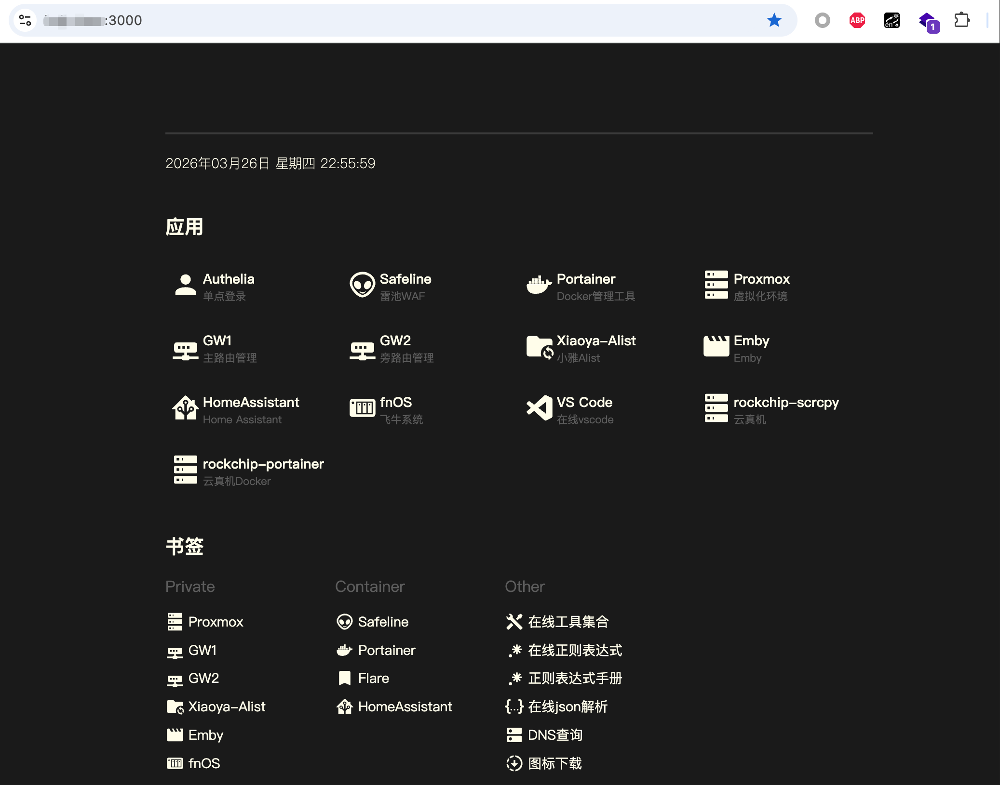

# fnOS

## 准备工作

1. 一台 NAS 主机，安装 [飞牛 OS](https://www.fnnas.com/)（可裸机安装，也可在 PVE 中以虚拟机形式运行）
2. 公网 IP（电信可联系运营商开放公网 IP）
3. 域名（需要配置 CNAME 记录 `*` 解析到本域名）

## 网络规划

以 All-in-One 宿主机（PVE）+ 多虚拟机方案为例，IP 分配如下：

| 角色 | 地址 |
|------|------|
| PVE 宿主机 | 10.10.10.254 |
| iKuai（主路由） | 10.10.10.253 |
| OpenWrt（旁路由） | 10.10.10.252 |
| fnOS | 10.10.10.1 |

> 裸机安装 fnOS 可跳过 PVE/iKuai/OpenWrt 部分，仅保留 fnOS 网络配置。

## 宿主机

### pve （按需）

1. 配置 IP（10.10.10.254/24），网关（10.10.10.252），DNS（10.10.10.252）
2. 安装 fnOS、iKuai、OpenWrt 虚拟机

## 虚拟机

### 主路由ikuai （按需）

1. 配置 IP（10.10.10.253）
2. 配置 DNS（114.114.114.114，8.8.8.8）
3. 配置 DHCP，客户端（10.10.10.0/24），网关（10.10.10.252），DNS（10.10.10.252，10.10.10.253）
4. 配置拨号
5. 配置 DDNS
6. 配置端口映射，把 3000~3010 端口映射到 fnOS（10.10.10.1）

### 旁路由openwrt （按需）

1. 配置 IP（10.10.10.252/24），网关（10.10.10.253），DNS（114.114.114.114，8.8.8.8），忽略 DHCP
2. 配置科学上网
3. 配置 VPN

### 飞牛系统

1. 配置 IP（10.10.10.1/24），网关（10.10.10.252），DNS（10.10.10.252）
2. 配置用户
3. 配置存储空间（磁盘分组、存储池）
4. 开启 Docker 服务（应用中心 → Docker → 启用）
5. 使用本项目一键搭建完整 homelab 环境

## 部署

### 最佳体验架构

```
公网请求
  │
  ▼
nginx（TLS 反向代理，ACME 自动证书）
  │
  ├─→ safeline（WAF，过滤恶意流量）
  │
  ├─→ authelia（SSO 单点登录 + 双因素认证）
  │       │
  │       └─→ lldap（LDAP 用户目录）
  │
  └─→ 各类应用（fnOS、Nextcloud、Alist、qBittorrent……）
```

> `fnos` 容器通过依赖链自动引入 `homelab`（含 Flare 主页）；`authelia`、`safeline` 需单独添加以启用 SSO 和 WAF。

### 安装环境

SSH 连接上 fnOS ，按照[文档](https://github.com/linktools-toolkit/linktools/blob/master/linktools-cntr/README.md)在 fnOS 中安装 Docker、Python3 等环境，然后安装 linktools-cntr：

```bash
python3 -m pip install -U linktools-cntr
```

### 部署 Docker 容器

第一次安装：

```bash
# 添加代码仓库（提示添加成功或者仓库已存在均是预期内的结果，可继续后续步骤）
ct-cntr repo add https://github.com/linktools-toolkit/linktools-homelab

# 添加基础容器
# fnos 包含了（homelab、flare），其他按需添加
# authelia 提供 SSO 单点登录，safeline 提供 WAF 防护
# portainer 用于可视化容器管理
ct-cntr add fnos authelia safeline portainer

# （按需）其他容器按需添加
ct-cntr add vscode gitlab home-assistant

# 配置容器数据存储路径，请自行修改App路径
ct-cntr config set \
  DOCKER_APP_PATH=/vol1/1000/Apps

# 重启策略要设置成always，要不然飞牛重启容器没法重启
ct-cntr config set \
  SERVICE_RESTART_POLICY=always

# 配置主域名和各种端口，打开泛域名解析，此处以 https://test.com:3000 为例，请按实际情况进行修改
ct-cntr config set \
  NGINX_ROOT_DOMAIN=test.com \
  NGINX_WILDCARD_DOMAIN=true \
  NGINX_HTTPS_ENABLE=true \
  NGINX_HTTP_PORT=3000 \
  NGINX_HTTPS_PORT=3002 \
  NGINX_WAF_PORT=8000

# 配置acme，用于自动申请 SSL 证书
# ACME_DNS_API 参数为 dnsapi 类型，比如用阿里云 DNS 就填 dns_ali，顺带配上所需的环境变量 Ali_Key 和 Ali_Secret
# 具体可参考：https://github.com/acmesh-official/acme.sh/wiki/dnsapi
ct-cntr config set \
  ACME_DNS_API=dns_ali \
  Ali_Key=xxx \
  Ali_Secret=yyy

# （按需）填写pve、主路由、旁路由等链接
ct-cntr config set \
  PVE_LOCAL_URL=https://10.10.10.254:8006 \
  PRIMARY_GATEWAY_LOCAL_URL=http://10.10.10.253 \
  BYPASS_GATEWAY_LOCAL_URL=http://10.10.10.252

# （按需）如果装了xiaoya-alist和emby全家桶，可以指定以下链接
ct-cntr config set \
  EMBY_LOCAL_URL=http://10.10.10.1:2345 \
  XIAOYA_ALIST_LOCAL_URL=http://10.10.10.1:5678

# 启动容器
ct-cntr up
```

后续升级版本执行以下命令更新即可：

```bash
# 更新代码库
ct-env update

# 更新容器仓库
ct-cntr repo update

# 启动容器
ct-cntr up
```

### 已部署的服务说明

| 服务 | 域名示例 | 说明 |
|------|----------|------|
| Flare | https://test.com:3000 | 主页导航，汇聚所有服务入口 |
| fnOS | https://fn.test.com:3000 | 飞牛 NAS 管理界面 |
| Authelia | https://sso.test.com:3000 | 单点登录 / 双因素认证 / 用户管理 |
| Safeline | https://safeline.test.com:3000 | 雷池 WAF 管理界面 |
| Portainer | https://portainer.test.com:3000 | Docker 容器可视化管理 |

### 配置 WAF

#### 1. 重置管理员密码并登录

通过以下命令重置 Safeline 管理员密码：

```bash
ct-cntr exec safeline reset-admin
```

访问 `http://10.10.10.1:9200/` 登录 Safeline 控制台。

#### 2. 添加防护站点

进入 **防护站点** → **添加应用**，按如下参数配置：

| 字段 | 值 |
|------|----|
| 域名 | `*` |
| HTTP 端口 | `8000`（与 `NGINX_WAF_PORT` 保持一致） |
| HTTPS 端口 | 删除，不填 |
| 上游服务器 | `http://nginx:8000`（协议固定http，域名固定nginx，端口与 `NGINX_WAF_PORT` 保持一致） |

保存后，开启**攻击防护**。

#### 3. 配置人机防护策略

针对需要加强防护的管理界面，可单独添加一个防护应用并开启人机验证，防止暴力破解。

以 fnOS 为例，进入 **防护站点** → **添加应用**：

| 字段 | 值 |
|------|----|
| 域名 | `fn.test.com` |
| HTTP 端口 | `8000`（与 `NGINX_WAF_PORT` 保持一致） |
| HTTPS 端口 | 删除，不填 |
| 上游服务器 | `http://nginx:8000`（协议固定http，域名固定nginx，端口与 `NGINX_WAF_PORT` 保持一致） |

保存后，开启**攻击防护**，并且进入该站点的**BOT 防护**标签，开启人机验证。

> 为避免误伤飞牛 App 端，需配置 UA 排除规则：当 User-Agent **不包含** `com.trim.app` 且**不包含** `FNAppVer` 时才触发人机验证。

同理，SSO（`sso.test.com`）也可按相同方式添加防护应用并开启人机验证，但需配置 URL 路径排除规则，避免影响 OIDC 等接口的正常调用：当请求路径**不以** `/api/` 开头且**不以** `/.well-known/` 开头时才触发人机验证。

### 配置 SSO

容器启动后，需要初始化 SSO 的用户目录。

#### 1. 获取管理员密码

lldap 管理员（`admin`）的初始密码可通过以下命令查看：

```bash
ct-cntr config list authelia
# 查看 AUTHELIA_LDAP_PASSWORD 字段
```

#### 2. 登录管理界面并绑定二步验证

进入 `https://sso.test.com:3000/auth-admin/`，以 `admin` 账号登录。

首次登录需要绑定二步验证（OTP 或 WebAuthn），Authelia 会生成验证链接，**只能通过命令行查看**：

```bash
ct-cntr exec authelia show-notification
```

复制输出的链接在浏览器中打开，按提示完成 OTP（如 Google Authenticator）或 WebAuthn 的绑定。

#### 3. 创建账号并加入 admins 组

登录成功后，在 `https://sso.test.com:3000/auth-admin/` 页面中管理用户：

1. 点击 **Groups** → **Create group**，创建 `admins` 组（若已存在可跳过）
2. 点击 **Users** → **Create user**，创建自己的账号
3. 回到 **Users**，打开自己的账号，在 **Groups** 标签中加入以下两个组：
   - `admins`：Authelia 管理员权限，默认拥有所有系统权限（除了 `/auth-admin/`）
   - `lldap_admin`：LLDAP 控制台管理权限（缺少此组将无法登录 `/auth-admin/`）

#### 4. 为自己账号绑定二步验证

打开浏览器**无痕模式**，访问 `https://sso.test.com:3000`，以自己的账号登录，按提示绑定 OTP 或 WebAuthn。所需的验证链接可通过以下任一方式查看：

- 命令行：
  ```bash
  ct-cntr exec authelia show-notification
  ```
- 或在 admin 账号已登录的 `https://sso.test.com:3000/auth-admin/` 页面 **Notifications** 中查看

> `admins` 组成员拥有所有接入 SSO 的服务的管理权限。

### 免密登录

很多人以为 SSO 只是"统一登录入口"，但它真正省事的地方在于：配置好之后，后端系统根本不需要再输密码。

Authelia 支持多种对接协议，覆盖范围很广：

| 协议 | 适用系统 |
|------|---------|
| OIDC（OpenID Connect） | Portainer、PVE、GitLab、Nextcloud 等支持标准 OIDC 的应用 |
| OAuth2 | 同上，很多现代应用两者都支持 |
| Basic Authentication 代理 | OpenWrt LuCI 等只有账号密码框的旧系统 |
| API Key 注入 | Safeline 等部分只支持 Token 认证的系统 |
| Forward Auth | 任何通过 nginx 反代的应用，无需应用本身改动 |

实际效果是：在 Authelia 登录一次、通过二步验证之后，打开 Portainer、Safeline、PVE、OpenWrt，这些系统不再需要输入密码。一次验证，全套放行。

### 配置 Docker 延迟加载

避免开机时未挂载磁盘就加载容器导致失败，通过以下命令编辑延迟启动 Docker：

```bash
SYSTEMD_EDITOR="vim" systemctl edit docker.service
```

添加以下配置实现延迟启动：

```
[Service]
ExecStartPre=/bin/sleep 60
```

## 最终效果


