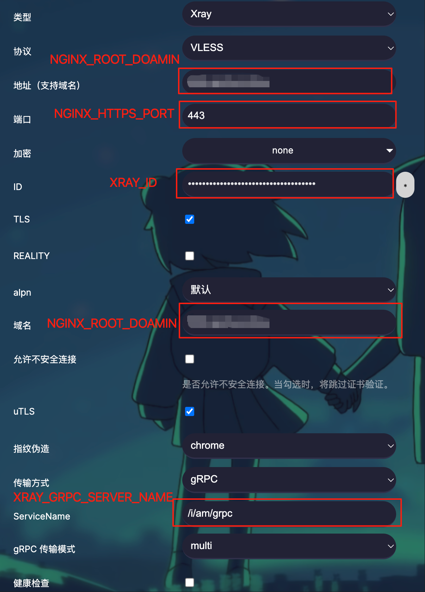

# xray scripts

## 准备工作

1. 一台vps
2. 域名（需要配置域名解析到vps的公网ip）

## 开始部署

先按照[文档](https://github.com/linktools-toolkit/linktools/blob/master/linktools-cntr/README.md)安装Docker、Python3等环境，然后按照以下命令部署Docker容器

第一次安装：
```
# 添加代码仓库（提示添加成功或者仓库已存在均是预期内的结果，可继续后续步骤）
ct-cntr repo add https://github.com/linktools-toolkit/linktools-homelab

# 添加容器，核心是xray-server，其他可选
ct-cntr add xray-server portainer 

# 配置主域名和acme，用于自动生成ssl证书
# ACME_DNS_API参数为dnsapi类型，比如用的阿里云的dns就填dns_ali，顺带配上Ali_Key和Ali_Secret参数
# 具体可参考：https://github.com/acmesh-official/acme.sh/wiki/dnsapi
ct-cntr config set \
    NGINX_ROOT_DOMAIN=test.com \
    NGINX_HTTPS_PORT=443 \
    ACME_DNS_API=dns_ali \
    Ali_Key=xxx \
    Ali_Secret=yyy

# 配置xray参数，也可以自动生成，通过ct-cntr config list xray-server命令查看
ct-cntr config set \
    XRAY_ID=aaaaaaaa-xxxx-yyyy-zzzz-bbbbbbbbbbbb

# 启动容器
ct-cntr up
```

后续升级版本执行以下命令更新即可：
```
# 更新代码仓库
ct-cntr repo update

# 启动容器
ct-cntr up
```

服务端支持gRPC和websocket协议，建议使用gRPC协议。其中：
- Websocket 协议的 Websocket Path 是 `/i/am/websocket`
- gRPC 协议的 ServiceName 是 `/i/am/grpc`

最后，Xray 客户端可以通过以下配置连接到 Xray 服务端


